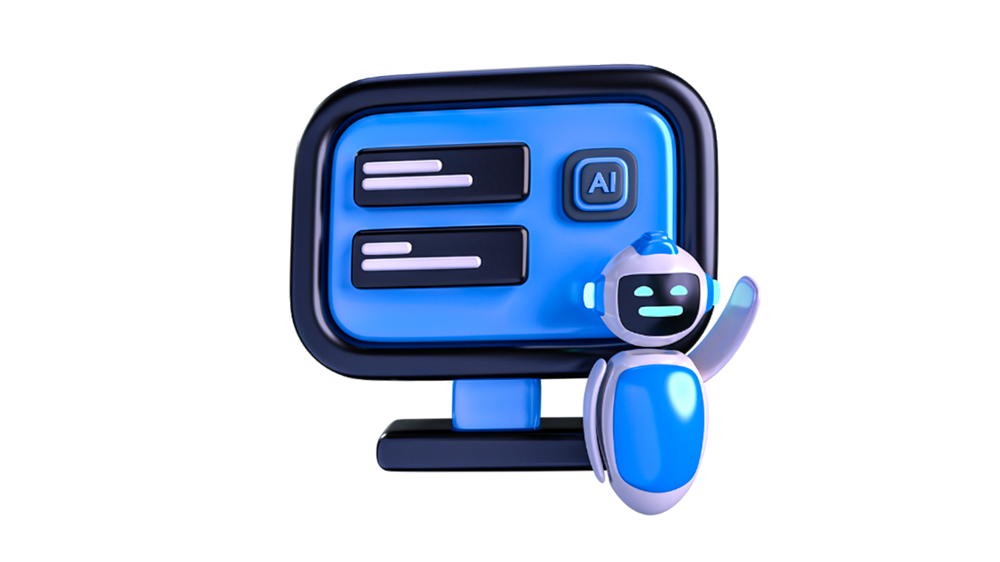

# 🚀 Bashir Ahmed — Flutter Portfolio

<div align="center">


**A fully responsive, cross-platform personal portfolio built with Flutter — showcasing projects, skills, education, certifications, and experience with a sleek dark UI.**

[🌐 Live Demo](https://bashii110.github.io) &nbsp;·&nbsp; [📄 Download CV](https://drive.google.com/file/d/1aBiu7DqflJcGCD6lhV4WvgMPsa2sCA5F/view?usp=drive_link) &nbsp;·&nbsp; [💼 LinkedIn](https://www.linkedin.com/in/bashir-ahmed110) &nbsp;·&nbsp; [🐙 GitHub](https://github.com/bashii110)

</div>

---

## ✨ Features

- 🎨 **Dark themed UI** with pink/blue gradient accents throughout
- 📱 **Fully responsive** — Mobile, Tablet, Desktop & Web
- 🔄 **Smooth animations** — tween animations, floating image, loading splash
- 🗂️ **5 sections** — Home, Projects, Experience, Education, Certifications
- 🔗 **Direct links** — GitHub repos, credential verification, CV download
- 📬 **WhatsApp connect** button for instant contact
- 🧭 **Side drawer** on mobile with skills, knowledge & social links
- 🌐 **Web deployable** via `flutter build web`

---

## 📸 Screenshots

| Mobile | Tablet | Desktop |
|--------|--------|---------|
|  |  |  |

> Replace the above with actual screenshots of your app.

---

## 🏗️ Project Structure

```
lib/
├── main.dart                        # App entry point
├── res/
│   └── constants.dart               # Colors, padding constants
├── model/
│   ├── project_model.dart           # Projects data
│   ├── education_model.dart         # Education data
│   ├── experience_model.dart        # Experience data
│   ├── certificate_model.dart       # Certifications data
│   └── skill_model.dart             # Skills data
├── view model/
│   ├── responsive.dart              # Breakpoint helper
│   ├── controller.dart              # PageView controller
│   └── getx_controllers/
│       ├── projects_controller.dart
│       ├── experience_controller.dart
│       ├── education_controller.dart
│       └── certification_controller.dart
└── view/
    ├── splash/                      # Splash screen
    ├── home/                        # Home entry widget
    ├── main/                        # Nav bar, drawer, layout
    ├── intro/                       # Hero introduction section
    ├── projects/                    # Projects grid
    ├── experience/                  # Work experience grid
    ├── education/                   # Education grid
    └── certifications/              # Certifications grid
```

---

## 📦 Tech Stack

| Technology | Usage |
|------------|-------|
| **Flutter** | UI framework |
| **Dart** | Programming language |
| **GetX** | State management (hover effects) |
| **Google Fonts** | Open Sans typography |
| **flutter_svg** | SVG icon rendering |
| **url_launcher** | External link handling |
| **photo_view** | Project image viewer |
| **font_awesome_flutter** | Icon pack |

---

## 🗂️ Pages

### 🏠 Home
Animated hero section with profile image, headline, subtitle, description and a CV download button. Social media icons on the side for desktop.

### 💼 Projects
Responsive grid of project cards. Each card shows the project name, description, tech stack, and links to GitHub and live demo.

### 🧑‍💻 Experience
Work experience cards showing job title, company, duration and a detailed list of responsibilities.

### 🎓 Education
Education cards displaying degree, institution, graduation year, and a link to the institution website.

### 🏅 Certifications
Certification cards with issuing organization, date, associated skills, and a direct credentials link.

---

## 🚀 Getting Started

### Prerequisites

- Flutter SDK `>=3.0.0`
- Dart SDK `>=3.0.0`
- Android Studio / VS Code

### Installation

```bash
# 1. Clone the repository
git clone https://github.com/bashii110/my_flutter_portfolio.git

# 2. Navigate into the project
cd my_flutter_portfolio

# 3. Install dependencies
flutter pub get

# 4. Run the app
flutter run
```

### Build for Web

```bash
flutter build web --release
```

### Build for Android

```bash
flutter build apk --release
```

---

## 📐 Responsive Breakpoints

| Breakpoint | Width | Layout |
|------------|-------|--------|
| Mobile | ≤ 400px | Single column, drawer nav |
| Large Mobile | ≤ 700px | Single column, drawer nav |
| Tablet | 700px – 1080px | 2-column grid, drawer nav |
| Desktop | 1080px – 1400px | 3-column grid, top nav |
| Extra Large | > 1400px | 4-column grid, top nav |

---

## 🎨 Design System

```dart
const bgColor       = Color(0xFF000515);  // Deep navy background
const darkColor     = Color(0xFF191923);  // Card background
const secondaryColor= Color(0xFF242430);  // Secondary surfaces
const bodyTextColor = Color(0xFF8B8B8D);  // Body text
const defaultPadding= 20.0;              // Base spacing unit

// Accent gradient: Colors.pink → Colors.blue.shade900
```

---

## 👤 About Me

**Bashir Ahmed** — Flutter Developer & Software Engineering student at Quaid e Awam University, Nawabshah (2026).

Passionate about building clean, responsive, and production-ready cross-platform applications.

| | |
|--|--|
| 📧 Email | buxhiisd@gmail.com |
| 📞 Phone | +92 306 3440645 |
| 💼 LinkedIn | [bashir-ahmed110](https://www.linkedin.com/in/bashir-ahmed110) |
| 🐙 GitHub | [@bashii110](https://github.com/bashii110) |
| 📘 Facebook | [romeo.dahrii](https://www.facebook.com/romeo.dahrii) |
| 📸 Instagram | [@bashirs.dripp._](https://www.instagram.com/bashirs.dripp._) |

---

## 📜 License

This project is open source and available under the [MIT License](LICENSE).

---

<div align="center">

Made with ❤️ and Flutter by **Bashir Ahmed**

⭐ Star this repo if you found it helpful!

</div>
